# Installation Guide Using Miniconda
This guide provides a step-by-step process to install the **Telegram_News_SemAnalysis** Python package. The instructions are demonstrated on macOS but are applicable to other platforms using Miniconda.
## 1. Create a Virtual Environment 
First, create a virtual environment using Miniconda: 
```bash
conda create --name SemAn
```
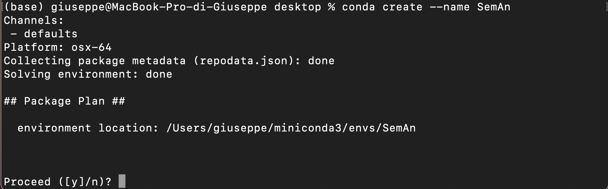
When prompted, type `y` to confirm the creation of the environment.
## 2. Activate the Virtual Environment
Activate the virtual environment using the following command:
```bash
conda activate SemAn
```
![[activate env]](Images/activate_virtual_enc.png)
After activation, the environment's name will appear in brackets on the terminal prompt.
## 3. Install Python Interpreter
Telegram_News_SemAnalysis works with **python 3.10**. Install the correct version using the following command:
```bash
conda install python=3.10
```
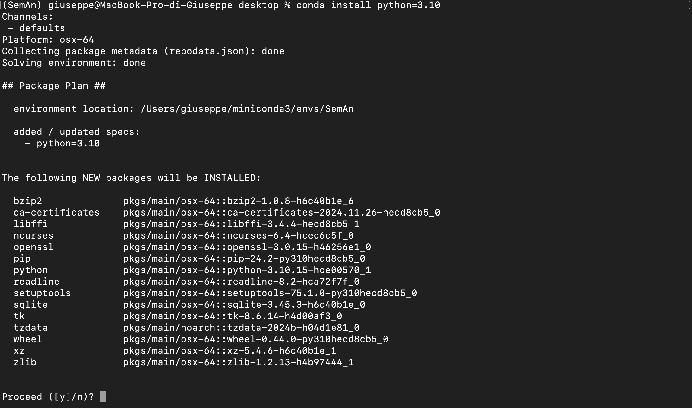
## 4. Navigate to the Desired Directory
Choose a directory to store the repository. Navigate to your desired location using:
```bash
cd /path/to/your/desired/directory
```
to take a step back use:
```bash
cd ..
```

Example for Windows users:
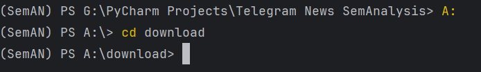

Once satisfied with your current directory, proceed to the next step of the installation guide.
## 5. Clone the Github Repository
Clone the repository into the selected directory. For this example, we'll use the desktop:
```bash
git clone https://github.com/Gaguine/Telegram_News_SemAnalysis.git
```
You should now see the `Telegram_News_SemAnalysis` folder in your chosen directory.

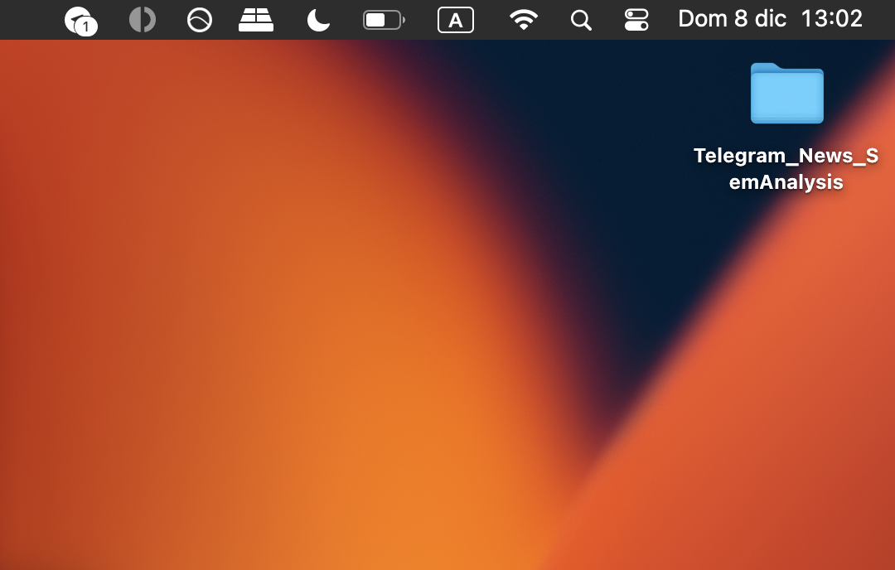
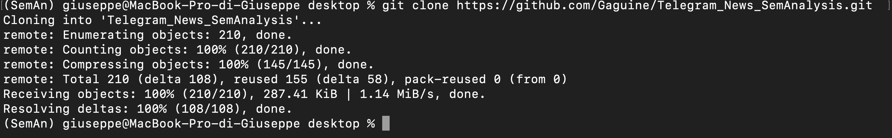
To ensure the repository URL is up-to-date, follow these steps to get the latest cloning link:

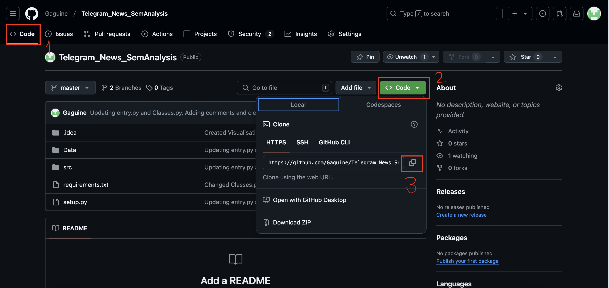

## 6. Install Telegram_News_SemAnalysis Using `pip`
Navigate into the cloned repository:
```bash
cd Telegram_News_SemAnalysis
```

Then install the package using:
```bash
pip install .
```
You can find the complete list of dependencies in the `requirements.txt` file.
## Congratulations!

You have successfully installed the **Telegram_News_SemAnalysis** package! 🎉

# Run Your First Analysis!
## Collect the Input Data
Use Telegram's *export chat history* feature to collect the data you wish to analyse.![[Export_Chat_history.png]]
- Untick the **Photos** parameter to speed up the export process. 
- Then click the **Export** button.

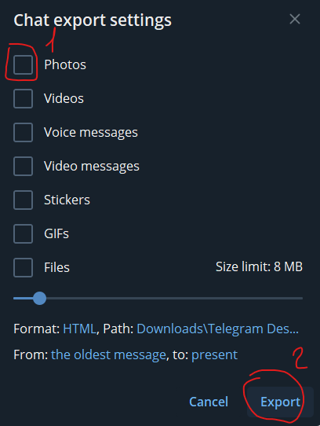
## Locate the Data folder in the Repository Directory
Within the repository directory, locate the **Data** folder. Ignore the `.txt` file and place the `.html` files you wish to analyze into this folder.


## Start the Analysis
Return to the console and run the following command to start the analysis:
```bash
SemAn run -re 55
```
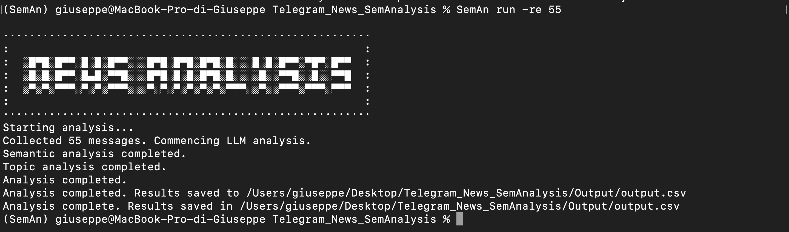
- **--restriction** or **-re**: Limits the number of messages to analyze.
    - Example: `-re 55` analyzes the first 55 messages.
    - Default: If not specified, the program analyzes all input data.

> **Note:** Analyzing large amounts of data may take a toll on your system, so be mindful of the dataset size.

## View the Output
The analysis results will be stored in the **Output** folder within the cloned repository directory.

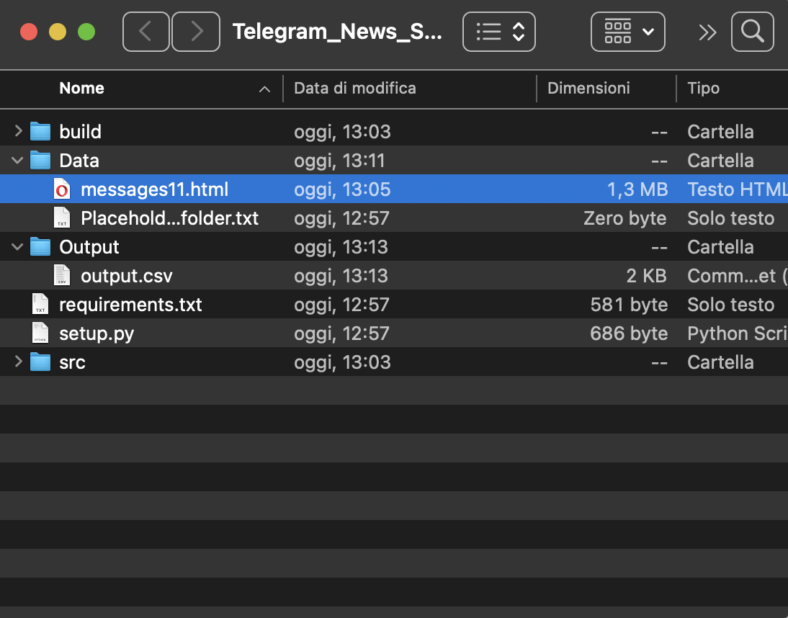
# Visualisation
Telegram_News_SemAnalysis can also visualize the analysis results for insight generation!
Here are some examples:
- To visualize the semantic tag timeline for each day use the following command:
```bash
SemAn visualize --general_timeline
```
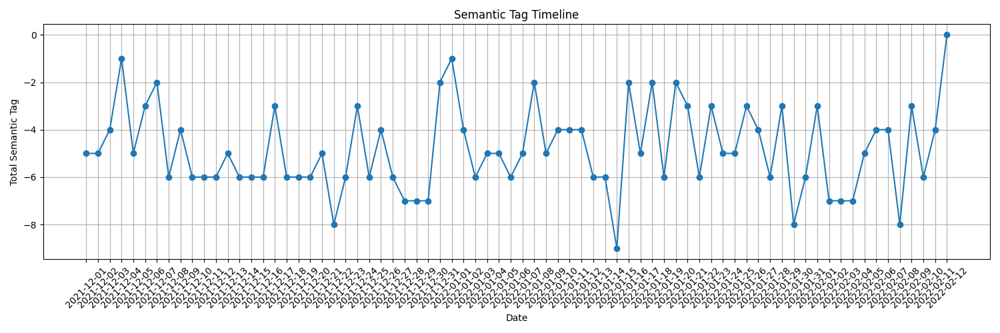
- To visualize the topic timeline use the following command:
```bash
SemAn visualize --topic_dynamics_timeline
```
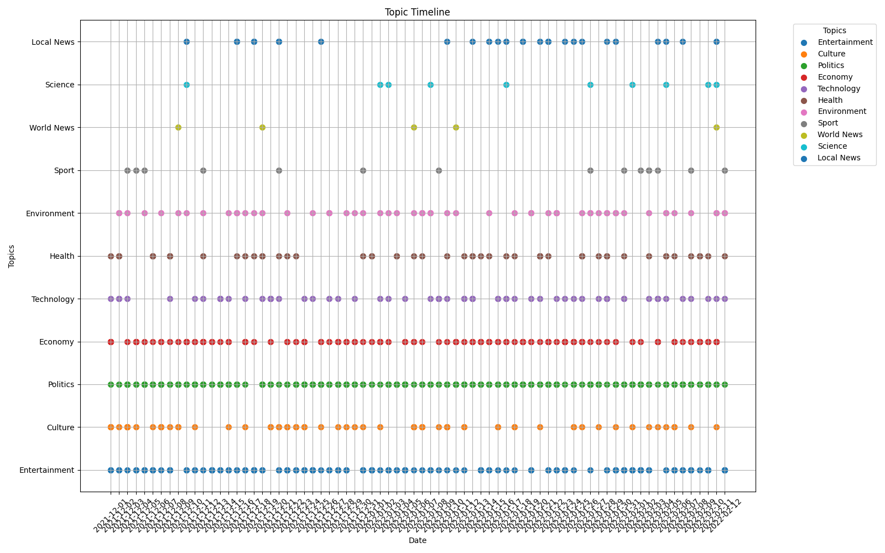
## Visualisation Cheatsheet
The **visualize** command provides multiple options to create visualizations from the analysis output. Below is a detailed guide to the available arguments.
### General Syntax 
To use the **visualize** command, run: 
```bash
SemAn visualize [argument]
```
## Available Arguments
1. **General Timeline**
	1. `-gt` or `--general_timeline`
2. **Topic Dynamics Timeline**
	1. `-tdt` or `--topic_dynamics_timeline`
3. **General Histogram**
	1. `-gh` or `--general_histogram`
4. **Semantic Tag Timeline for a Specific Topic**
	1. `-tt` or `--topic_timeline`
	2. `SemAn visualize -tt Economy`
	3. The topic should be in the output.csv
5. **Topic Histogram**
	1. `-th` or `--topic_histogram`
	2. `SemAn visualize -th Economy`
	3. The topic should be in the output.csv
6. **Topic Frequency Histogram**
	1. `-tfh` or `--topic_frequency_hist`
	2. `SemAn visualize -tfh`
	3. Shows the topic frequency from the CSV output.
